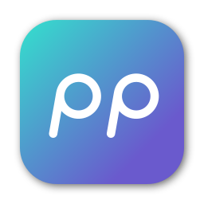

<h1 align="center">Welcome to Presto Parts 🎺</h1>

<p>
  
  
  <a href="LICENSE" target="_blank">
    
  </a>
  </a>
</p>

> Presto Parts saves music instructors hours of time: organize sheet music PDFs
> in a few minutes, not many hours. Presto Parts restructures collections of
> sheet music to be by instrument part (ready to hand to musicians), not by song
> (how it is originally distributed by the arranger).

### 🏠 [Homepage](https://prestoparts.org)

## Install

```sh
git clone https://github.com/c-o-l-i-n/presto-parts.git && cd presto-parts && npm install
```

## Usage

```sh
npm start
```

## Author

👤 **Colin A. Williams**

- Website: [colinaw.com](https://colinaw.com)
- Github: [@c-o-l-i-n](https://github.com/c-o-l-i-n)

[](https://www.buymeacoffee.com/colinw)

## 🤝 Contributing

Contributions, issues and feature requests are welcome!<br />Feel free to check
[issues page](https://github.com/c-o-l-i-n/presto-parts/issues).

## Show your support

Give a ⭐️ if this project helped you!

## 📝 License

Copyright © 2022 [Colin A. Williams](https://github.com/c-o-l-i-n).<br /> This
project is [MIT](https://github.com/c-o-l-i-n/presto-parts/blob/main/LICENSE)
licensed.
